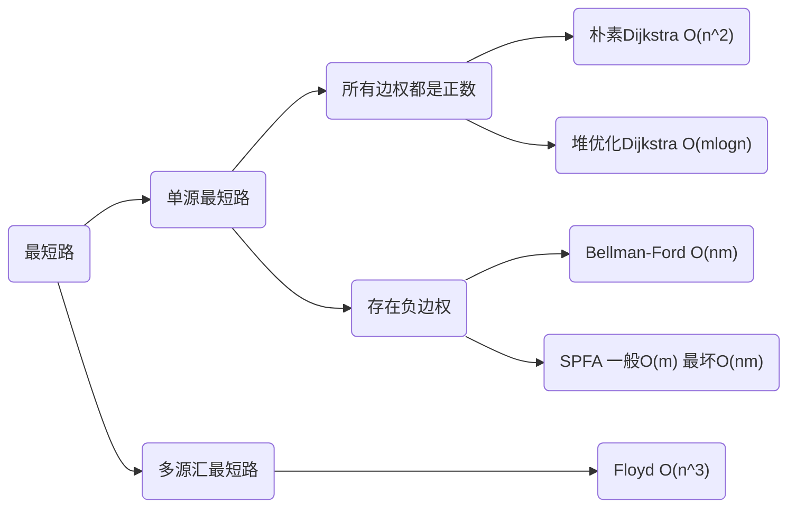

# 关于

包含邻接表、树的重心、有向图的拓扑排序、Dijkstra、bellman-ford、spfa、Floyd、Prim、Fruskal、染色法判定二分图、匈牙利算法。

# 邻接表

```cpp
const int maxn = 1e5+50; //点的数量
const int maxm = 2e5+50; //边的数量

int h[maxn], e[maxm], ne[maxm];
int top;

void init(){
    memset(h, -1, sizeof(h));
}

void add_edge(int a, int b){
    e[top] = b;
    ne[top] = h[a];
    h[a] = top++;
}

void travel(int u){
    for(int i = h[u]; i!=-1; i = ne[i]){
        int v = e[i];
        //do something
    }
}
```

# 树的重心

重心定义：重心是指树中的一个结点，如果将这个点删除后，剩余各个连通块中点数的最大值最小，那么这个节点被称为树的重心。

```cpp
int ans = 0x3f3f3f3f;
int n; //点数

//返回以某结点为根的z
int dfs(int u){
    
    vis[u] = true;
    int res = 0, tot = 1;
    for(int i = h[u]; i!=-1; i = ne[i]){
        int v = e[i];
        if(!vis[v]){
            int p = dfs(v);
            res = max(res, p);
            tot += p;
        }
    }
    res = max(res, n - tot);
    ans = min(ans, res);
    
    return tot;
}

void solve(){
    dfs(1);
}
```

# 拓扑排序

```cpp
int n; //结点数
int in[maxn]; //入度

bool topsort(vector<int>& ans){
    ans.clear();
    int cnt = 0; //插入结点的数量
    
    queue<int> q;
    for(int i = 1; i<=n; i++)
        if(!in[i]) {
            q.push(i);
            ans.push_back(i);
            cnt++;
        }
            
    while(!q.empty()){
        int u = q.front(); q.pop();
        for(int i = h[u]; i!=-1; i = ne[i]){
            int v = e[i];
            if(--in[v] == 0) {
                q.push(v);
                ans.push_back(v);
                cnt++;
            }
        }
    }
    
    return cnt == n;
}
```

# 最短路算法选择



# Dijkstra

## 朴素做法

```cpp
int n, m; 
const int maxn = 500+20;
int g[maxn][maxn];
void add(int a, int b, int c){
	g[a][b] = min(g[a][b], c);
}
int dist[maxn];
bool vis[maxn];
void dijkstra(){
	memset(dist, 0x3f, sizeof dist);
	dist[1] = 0;
	for(int k = 0; k<n-1; k++){
		int t = -1;
		for(int i = 1; i<=n; i++)
			if(!vis[i] && (t==-1 || dist[i] < dist[t]))
				t = i;
		vis[t] = true;
		for(int i = 1; i<=n; i++)
			dist[i] = min(dist[i], dist[t] + g[t][i]);
	}
}
```

## 堆优化

```cpp
const int maxn = 2e5+20;
const int maxm = 2e5+20;
int h[maxn], e[maxm], ne[maxm], w[maxm], top;
void add(int a, int b, int c){
	e[top] = b, w[top] = c, ne[top] = h[a], h[a] = top++;
}

struct Node{
	int u, d;
	bool operator < (const Node& b) const {
		return d > b.d;
	}
};

bool vis[maxn];
int dist[maxn];
void dijkstra(){
	memset(dist, 0x3f, sizeof dist);
	priority_queue<Node> q; dist[1] = 0; q.push({1, 0});
	while(!q.empty()){
		Node t = q.top(); q.pop();
		int u = t.u;
		if(vis[u]) continue;
		vis[u] = true;
		for(int i = h[u]; ~i; i = ne[i]){
			int v = e[i];
			if(dist[v] > dist[u] + w[i]){
				dist[v] = dist[u] + w[i];
				q.push({v, dist[v]});
			}
		}
	}
}
```

# bellman-ford

1 号点到 n 号点的最多经过 k 条边的最短距离

```cpp
const int maxn = 510;
const int maxm = 1e4+20;
const int INF = 0x3f3f3f3f;

int n, m, k;
int dist[maxn], backup[maxn];
int a[maxm], b[maxm], w[maxm]; //存边

//不连通返回INF
int bellman_ford(){
    
    memset(dist, 0x3f, sizeof(dist));
    dist[1] = 0;
    for(int i = 0; i<k; i++){        
        memcpy(backup, dist, sizeof(dist));
        for(int j = 0; j<m; j++){
            dist[b[j]] = min(dist[b[j]], w[j] + backup[a[j]]);
        }
    }    
    return dist[n] > INF / 2 ? INF : dist[n]; 
}
```

# spfa

## 求最短路

```cpp
const int maxn = 1e5+50;
const int maxm = 1e5+50;
const int INF = 0x3f3f3f3f;
int n, m;

int dist[maxn];
bool vis[maxn];

int h[maxn], e[maxm], weight[maxm], ne[maxm], idx;

void init(){
    memset(h, -1, sizeof(h));
}

void add_edge(int a, int b, int w){
    e[idx] = b; weight[idx] = w; 
    ne[idx] = h[a];
    h[a] = idx++;
}

//不连通返回INF
int spfa(){

    memset(dist, 0x3f, sizeof(dist));
    dist[1] = 0;
    
    queue<int> q; q.push(1); vis[1] = true;
    while(!q.empty()){
        int u = q.front(); q.pop(); vis[u] = false;
        
        for(int i = h[u]; i!=-1; i = ne[i]){
            int v = e[i], w = weight[i];
            if(dist[v] > dist[u] + w){
                dist[v] = dist[u] + w;
                if(!vis[v]) q.push(v), vis[v] = true;
            }
        }
    }
    
    return dist[n];
}
```

## 判断负环

统计当前每个点最短路包含的边数，如果边数大于等于n说明有负环。

加速trick:

- 更新数超过了2n或3n次，判定为存在负环
- 将队列改为栈

```cpp
const int maxn = 1e5+50;
const int maxm = 1e5+50;
int n, m;

int dist[maxn], cnt[maxn];
bool vis[maxn];

bool spfa(){
    
    queue<int> q;
	for(int i = 1; i<=n; i++){
		q.push(i);
		vis[i] = true;
	}
	
	while(!q.empty()){
		int u = q.front(); q.pop(); vis[u] = false;
		
		for(int i = h[u]; ~i; i = ne[i]){
			int v = e[i];
			if(dist[v] > dist[u] + w[i]){
				dist[v] = dist[u] + w[i];
				cnt[v] = cnt[u] + 1;
				if(cnt[v] >= n) return true;
				if(!vis[v]) q.push(v), vis[v] = true;
			}
		}
	}
	
	return false;
}
```

# Floyd

## 最短路

```cpp
int n, m, k;
const int INF = 0x3f3f3f3f;
const int maxn = 210;
int g[maxn][maxn];

void init(){
    memset(g, 0x3f, sizeof(g));
    for(int i = 0; i<maxn; i++) g[i][i] = 0;
}

//需要处理重边
void add_edge(int a, int b, int w){
    g[a][b] = min(g[a][b], w);
}

//g[i][j] > INF / 2 表示不连通
void floyd(){   
    for(int k = 1; k<=n; k++)
        for(int i = 1; i<=n; i++)
            for(int j = 1; j<=n; j++)
                g[i][j] = min(g[i][k] + g[k][j] , g[i][j]);
}
```

## 传递闭包

```cpp
void init(){
    memset(g, 0, sizeof(g));
}

void floyd(){
    for(int k = 0; k<n; k++)
        for(int i = 0; i<n; i++)
            for(int j = 0; j<n; j++)
                if(d[i][k] && d[k][j]) d[i][j] = 1;
}
```

## 最小环

给定一张无向图，求图中一个至少包含3个点的环，环上的节点不重复，并且环上的边的长度之和最小

```cpp
int n, m; 
const int INF = 0x3f3f3f3f;
const int maxn = 120;
int g[maxn][maxn], d[maxn][maxn];
int pos[maxn][maxn];
vector<int> v; //保存最小环的向量
int res = INF; //最小环长

void init(){
    memset(g, 0x3f, sizeof g);
    for(int i = 0; i<maxn; i++)g[i][i] = 0;
}

void add(int a, int b, int c){
    g[a][b] = g[b][a] = min(g[a][b], c);
}

void get_path(int i, int j){
    if(pos[i][j] == 0) return;
    int k = pos[i][j];
    get_path(i, k);
    v.push_back(k);
    get_path(k, j);
}

void floyd(){
    memcpy(d, g, sizeof g);

    for(int k = 1; k<=n; k++){

        for(int i = 1; i<k; i++){
            for(int j = i+1; j<k; j++){
                if((long long)d[i][j] + g[j][k] + g[k][i] < (long long)res){
                    res = d[i][j] + g[j][k] + g[k][i];
                    v.clear();
                    v.push_back(i);
                    get_path(i, j);
                    v.push_back(j);
                    v.push_back(k);
                }
            }
        }

        for(int i = 1; i<=n; i++){
            for(int j = 1; j<=n; j++){
                if(d[i][j] > d[i][k] + d[k][j]){
                    d[i][j] = d[i][k] + d[k][j];
                    pos[i][j] = k;
                }
            }
        }

    }
}
```

## 恰好经过k条边的最短路

```cpp
int k, m;
int n;

const int maxn = 210;
int g[maxn][maxn];
int res[maxn][maxn];
int tmp[maxn][maxn];

void init(){
    memset(g, 0x3f, sizeof g);
    //g[i][i]不要初始化成0
}

void add(int a, int b, int c){
    g[a][b] = g[b][a] = min(g[a][b], c);
}

void mul(int c[][maxn], int a[][maxn], int b[][maxn]){
	memset(tmp, 0x3f, sizeof tmp);
	for(int k = 1; k<=n; k++)
		for(int i = 1; i<=n; i++)
			for(int j = 1; j<=n; j++)
				tmp[i][j] = min(tmp[i][j], a[i][k] + b[k][j]);
	memcpy(c, tmp, sizeof tmp);
}

void qmi(){
	memset(res, 0x3f, sizeof res);
	for(int i = 1; i<=n; i++) res[i][i] = 0;
	while(k){
		if(k&1) mul(res, res, g);
		mul(g, g, g);
		k >>= 1;
	}
}
```

# Prim

## 朴素做法

用于稠密图。复杂度 $O(n^2)$ 

```cpp
const int maxn = 520;
const int INF = 0x3f3f3f3f;

int n, m; 
int dist[maxn];
int g[maxn][maxn];
bool vis[maxn];

void init(){
    memset(g, INF, sizeof(g));
}

void add_edge(int a, int b, int v){
     g[a][b] = g[b][a] = min(g[a][b], v);
}

// 不连通时返回INF
int prim(){
    
    memset(dist, INF, sizeof(dist));
    dist[1] = 0;
    
    int ret = 0;
    for(int i = 0; i<n; i++){
    
        int t = -1;
        for(int j = 1; j<=n; j++) 
            if(!vis[j] && (t == -1 || (dist[j] < dist[t])))
                t = j;
        
        if(dist[t] == INF) return INF;
        ret += dist[t];
        
        for(int j = 1; j<=n; j++)
            dist[j] = min(dist[j], g[t][j]);
            
        vis[t] = true;
    }
    
    return ret;
}
```

## 堆优化

用于稀疏图，不常用。复杂度 $O(mlogn)$ 

# Kruskal

用于稀疏图。复杂度 $O(mlogm)$

```cpp
const int INF = 0x3f3f3f3f;
const int maxm = 2e5+20;

int n, m;
struct Edge{
    int u, v, w;
    bool operator < (const Edge& e) const {
        return w < e.w;
    };
};
Edge edges[maxm];

int p[maxm];
int find(int x){
    if(x != p[x]) p[x] = find(p[x]);
    return p[x];
}

// 不连通时返回INF
int kruskal(){
    
    for(int i = 1; i<=n; i++) p[i] = i;
    
    int res = 0;
    int cnt = 0;
    
    sort(edges, edges+m);
    for(int i = 0; i<m; i++){
        int a = edges[i].u, b = edges[i].v, w = edges[i].w;
        int pa = find(a); int pb = find(b);       
        if(pa != pb){
            p[pa] = pb;
            res += w;
            cnt++;
        }
    }
    
    if(cnt == n-1) return res;
    else return INF;
}
```

# 染色法判定二分图

复杂度 $O(n+m)$

一个图是二分图当且仅当图中不含有奇数环。

```cpp
const int maxn = 1e5+20;
const int maxm = 2e5+20;

int n, m;
int h[maxn], e[maxm], ne[maxm]; int top;
int color[maxn];

void init(){
    memset(color, -1, sizeof(color));
    memset(h, -1, sizeof(h));
}

void add_edge(int u, int v){
    e[top] = v;
    ne[top] = h[u];
    h[u] = top++;
}

bool dfs(int u, int c){
    
    if(color[u] != -1) return color[u] == c;
    
    color[u] = c;
    for(int i = h[u]; i!=-1; i = ne[i]){
        if(!dfs(e[i], c^1)) 
            return false;
    }
    return true;
}

bool solve(){
    
    for(int i = 1; i<=n; i++){
        if(color[i] == -1) 
            if(!dfs(i, 0))
                return false;
    }
    return true;
}
```

# 匈牙利算法

复杂度 $O(nm)$ ，但实际运行时间一般远小于 $O(nm)$ 。

```cpp
const int maxn = 520;
const int maxm = 1e5+20;

int n1, n2, m;
int h[maxn], ne[maxm], e[maxm], top;
bool vis[maxn];
int match[maxn];

void init(){
    memset(h, -1, sizeof(h));
}

void add_edge(int a, int b){
    e[top] = b;
    ne[top] = h[a];
    h[a] = top++;
}

bool find(int x){
    
    for(int i = h[x]; i!=-1; i = ne[i]){
        int j = e[i];
        if(vis[j]) continue;
        vis[j] = true;
        if(match[j] == 0 || find(match[j])){
            match[j] = x;
            return true;
        }
    }
    
    return false;
}

int solve(){
    int res = 0;
    
    for(int i = 1; i<=n1; i++){
        memset(vis, 0, sizeof(vis));
        if(find(i)) res++;
    }
    
    return res;
}
```

