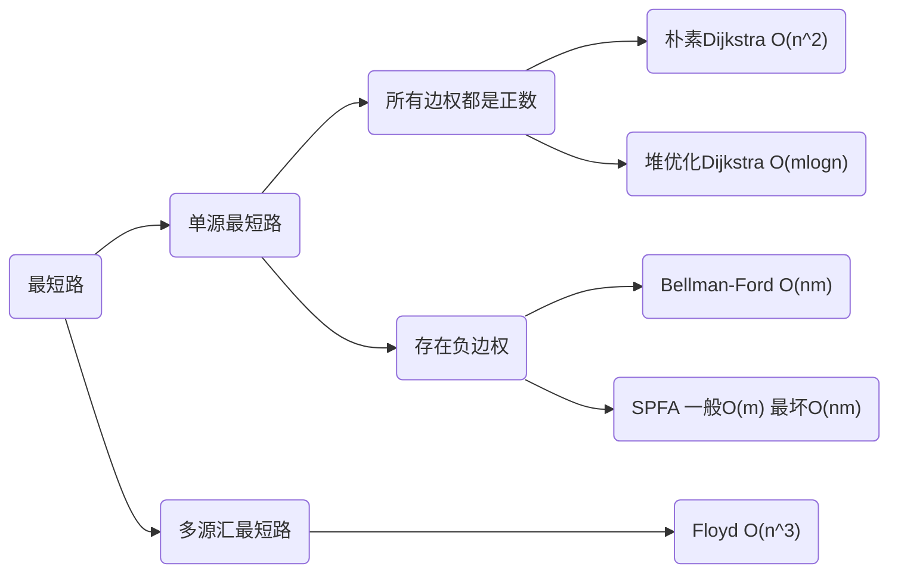

# 关于

包含邻接表、树的重心、拓扑排序、欧拉路径、最短路、生成树、二分图、Tarjan、线段树建图、网络流。

# 邻接表

```cpp
const int maxn = 1e5+50; //点的数量
const int maxm = 2e5+50; //边的数量

int h[maxn], e[maxm], ne[maxm];
int top;

void init(){
    memset(h, -1, sizeof(h));
}

void add_edge(int a, int b){
    e[top] = b;
    ne[top] = h[a];
    h[a] = top++;
}

void travel(int u){
    for(int i = h[u]; i!=-1; i = ne[i]){
        int v = e[i];
        //do something
    }
}
```

# 树的重心

重心定义：重心是指树中的一个结点，如果将这个点删除后，剩余各个连通块中点数的最大值最小，那么这个节点被称为树的重心。

```cpp
int ans = 0x3f3f3f3f;
int n; //点数

//返回以某结点为根的z
int dfs(int u){
    
    vis[u] = true;
    int res = 0, tot = 1;
    for(int i = h[u]; i!=-1; i = ne[i]){
        int v = e[i];
        if(!vis[v]){
            int p = dfs(v);
            res = max(res, p);
            tot += p;
        }
    }
    res = max(res, n - tot);
    ans = min(ans, res);
    
    return tot;
}

void solve(){
    dfs(1);
}
```

# 拓扑排序

```cpp
int n; //结点数
int in[maxn]; //入度

bool topsort(vector<int>& ans){
    ans.clear();
    int cnt = 0; //插入结点的数量
    
    queue<int> q;
    for(int i = 1; i<=n; i++)
        if(!in[i]) {
            q.push(i);
            ans.push_back(i);
            cnt++;
        }
            
    while(!q.empty()){
        int u = q.front(); q.pop();
        for(int i = h[u]; i!=-1; i = ne[i]){
            int v = e[i];
            if(--in[v] == 0) {
                q.push(v);
                ans.push_back(v);
                cnt++;
            }
        }
    }
    
    return cnt == n;
}
```

# 欧拉路径

模板中的```ans```数组保存的是边的id，若要输出点的编号，需要输出```e[ans[i]]```。

## 有向图
保证图连通的情况下
1. 存在**欧拉路径**的充要条件：要么所有点的出度均等与入度；要么一个点满足出度比入度多1（起点），一个点满足入度比出度多1（终点），其余所有点入度等于出度。
2. 存在**欧拉回路**的充要条件：所有点入度等于出度。

对于有向图，若需要字典序最小，则对于点 $u$ ，遍历临点 $v$ 的顺序需要从小到大。可以将边离线按照 $v$ 降序排序，再用邻接表存储，则保证遍历顺序为升序。

```cpp
int din[maxn], dout[maxn]；
int ans[maxm], cnt;

void dfs(int u) {
    for(int &i = h[u]; ~i;) {
        int t = i;
        int v = e[i];
        i = ne[i];
        dfs(v);
        ans[++cnt] = t;
    }
}

int s;
bool solve() {
    int cnt_in = 0, cnt_out = 0, cnt_other = 0;
    for(int i = 1; i<=n; i++) {
        if(din[i] == dout[i]) cnt_other++;
        if(din[i] == dout[i] + 1) cnt_out++;
        if(din[i] + 1 == dout[i]) cnt_in++;
    }
    bool f1 = cnt_in == 1 && cnt_out == 1 && cnt_other == n-2;
    bool f2 = cnt_in == 0 && cnt_out == 0 && cnt_other == n;
    // f1 = false; 求欧拉回路时将此语句打开
    if(!f1 && !f2) return false;

    s = 1; //图中无任何边时从1号点dfs防止re
    for(int i = 1; i<=n; i++) {
        if(f1 && din[i] + 1 == dout[i]) {s = i; break;}
        if(f2 && din[i]+dout[i]) {s = i; break;}
    }
    dfs(s);

    if(cnt < m) return false;

    return true;
}
```

## 无向图
保证图连通的情况下
1. 存在**欧拉路径**的充要条件：度数为奇数的点只能有0或2个。
2. 存在**欧拉回路**的充要条件：度数为奇数的点只能有0个。

对于无向图，若需要字典序最小，需要使用```set```存图，dfs如下。
```cpp
void dfs(int u) {
    while(g[u].size()) {
        int v= *g[u].begin();
        g[u].erase(v), g[v].erase(u);
        dfs(v);
        ans[++cnt] = u;
    }
}
```

```cpp
int de[maxn];
int used[maxn];
int ans[maxm], cnt;

void dfs(int u) {
    for(int &i = h[u]; ~i;) {
        if (used[i]) {
            i = ne[i];
            continue;
        }
        used[i] = true;
        used[i ^ 1] = true;

        int t = i;
        int v = e[i];
        i = ne[i];
        dfs(v);

        ans[ ++ cnt] = t;
    }
}

int s;
bool solve() {
    int cnt_odd = 0;
    for(int i = 1; i<=n; i++) {
        if(de[i]&1) cnt_odd++;
    }
    bool f1 = cnt_odd == 2;
    bool f2 = cnt_odd == 0;
    // f1 = false; 求欧拉回路时将此语句打开
    if(!f1 && !f2) return false;

    s = 1; //图中无任何边时从1号点dfs防止re
    for(int i = 1; i<=n; i++) {
        if(f1 && de[i]&1) {s = i; break;}
        if(f2 && de[i]) {s = i; break;}
    }
    dfs(s);

    if(cnt < m) return false;

    return true;
}
```

# 最短路算法选择



# Dijkstra

## 朴素做法

```cpp
int n, m; 
const int maxn = 500+20;
int g[maxn][maxn];
void add(int a, int b, int c){
	g[a][b] = min(g[a][b], c);
}
int dist[maxn];
bool vis[maxn];
void dijkstra(){
	memset(dist, 0x3f, sizeof dist);
	dist[1] = 0;
	for(int k = 0; k<n-1; k++){
		int t = -1;
		for(int i = 1; i<=n; i++)
			if(!vis[i] && (t==-1 || dist[i] < dist[t]))
				t = i;
		vis[t] = true;
		for(int i = 1; i<=n; i++)
			dist[i] = min(dist[i], dist[t] + g[t][i]);
	}
}
```

## 堆优化

```cpp
const int maxn = 2e5+20;
const int maxm = 2e5+20;
int h[maxn], e[maxm], ne[maxm], w[maxm], top;
void add(int a, int b, int c){
	e[top] = b, w[top] = c, ne[top] = h[a], h[a] = top++;
}

struct Node{
	int u, d;
	bool operator < (const Node& b) const {
		return d > b.d;
	}
};

bool vis[maxn];
int dist[maxn];
void dijkstra(){
	memset(dist, 0x3f, sizeof dist);
	priority_queue<Node> q; dist[1] = 0; q.push({1, 0});
	while(!q.empty()){
		Node t = q.top(); q.pop();
		int u = t.u;
		if(vis[u]) continue;
		vis[u] = true;
		for(int i = h[u]; ~i; i = ne[i]){
			int v = e[i];
			if(dist[v] > dist[u] + w[i]){
				dist[v] = dist[u] + w[i];
				q.push({v, dist[v]});
			}
		}
	}
}
```

# bellman-ford

1 号点到 n 号点的最多经过 k 条边的最短距离

```cpp
const int maxn = 510;
const int maxm = 1e4+20;
const int INF = 0x3f3f3f3f;

int n, m, k;
int dist[maxn], backup[maxn];
int a[maxm], b[maxm], w[maxm]; //存边

//不连通返回INF
int bellman_ford(){
    
    memset(dist, 0x3f, sizeof(dist));
    dist[1] = 0;
    for(int i = 0; i<k; i++){        
        memcpy(backup, dist, sizeof(dist));
        for(int j = 0; j<m; j++){
            dist[b[j]] = min(dist[b[j]], w[j] + backup[a[j]]);
        }
    }    
    return dist[n] > INF / 2 ? INF : dist[n]; 
}
```

# spfa

## 求最短路

```cpp
const int maxn = 1e5+50;
const int maxm = 1e5+50;
const int INF = 0x3f3f3f3f;
int n, m;

int dist[maxn];
bool vis[maxn];

int h[maxn], e[maxm], weight[maxm], ne[maxm], idx;

void init(){
    memset(h, -1, sizeof(h));
}

void add_edge(int a, int b, int w){
    e[idx] = b; weight[idx] = w; 
    ne[idx] = h[a];
    h[a] = idx++;
}

//不连通返回INF
int spfa(){

    memset(dist, 0x3f, sizeof(dist));
    dist[1] = 0;
    
    queue<int> q; q.push(1); vis[1] = true;
    while(!q.empty()){
        int u = q.front(); q.pop(); vis[u] = false;
        
        for(int i = h[u]; i!=-1; i = ne[i]){
            int v = e[i], w = weight[i];
            if(dist[v] > dist[u] + w){
                dist[v] = dist[u] + w;
                if(!vis[v]) q.push(v), vis[v] = true;
            }
        }
    }
    
    return dist[n];
}
```

## 判断负环

统计当前每个点最短路包含的边数，如果边数大于等于n说明有负环。

加速trick:

- 更新数超过了2n或3n次，判定为存在负环
- 将队列改为栈

```cpp
const int maxn = 1e5+50;
const int maxm = 1e5+50;
int n, m;

int dist[maxn], cnt[maxn];
bool vis[maxn];

bool spfa(){
    
    queue<int> q;
	for(int i = 1; i<=n; i++){
		q.push(i);
		vis[i] = true;
	}
	
	while(!q.empty()){
		int u = q.front(); q.pop(); vis[u] = false;
		
		for(int i = h[u]; ~i; i = ne[i]){
			int v = e[i];
			if(dist[v] > dist[u] + w[i]){
				dist[v] = dist[u] + w[i];
				cnt[v] = cnt[u] + 1;
				if(cnt[v] >= n) return true;
				if(!vis[v]) q.push(v), vis[v] = true;
			}
		}
	}
	
	return false;
}
```

## 差分约束

差分约束可以用来求不等式组的可行解。

源点需要满足的条件：从源点出发，一定可以走到所有的边。

### 可行解的最大值

步骤：

- 先将每个不等式 $x_i \leq x_j + c_k$ 转化成一条从 $x_j$ 走到 $x_i$，边长为 $c_k$ 的一条边
- 找一个超级源点，使得该源点一定可以遍历到所有边
- 从源点求一遍单源最短路。

结果：

- 如果存在负环，则原不等式组一定无解
- 如果没有负环，则```dist[i]```就是原不等式组可行解的最大值

### 可行解的最小值

步骤：

- 先将每个不等式 $x_i \geq x_j + c_k$ 转化成一条从 $x_j$ 走到 $x_i$，边长为 $c_k$ 的一条边
- 找一个超级源点，使得该源点一定可以遍历到所有边
- 从源点求一遍单源最长路。

结果：

- 如果存在负环，则原不等式组一定无解
- 如果没有负环，则```dist[i]```就是原不等式组可行解的最小值

# Floyd

## 最短路

```cpp
int n, m, k;
const int INF = 0x3f3f3f3f;
const int maxn = 210;
int g[maxn][maxn];

void init(){
    memset(g, 0x3f, sizeof(g));
    for(int i = 0; i<maxn; i++) g[i][i] = 0;
}

//需要处理重边

    g[a][b] = min(g[a][b], w);
}

//g[i][j] > INF / 2 表示不连通
void floyd(){   
    for(int k = 1; k<=n; k++)
        for(int i = 1; i<=n; i++)
            for(int j = 1; j<=n; j++)
                g[i][j] = min(g[i][k] + g[k][j] , g[i][j]);
}
```

## 传递闭包

```cpp
void init(){
    memset(g, 0, sizeof(g));
}

void floyd(){
    for(int k = 0; k<n; k++)
        for(int i = 0; i<n; i++)
            for(int j = 0; j<n; j++)
                if(d[i][k] && d[k][j]) d[i][j] = 1;
}
```

## 最小环

给定一张无向图，求图中一个至少包含3个点的环，环上的节点不重复，并且环上的边的长度之和最小

```cpp
int n, m; 
const int INF = 0x3f3f3f3f;
const int maxn = 120;
int g[maxn][maxn], d[maxn][maxn];
int pos[maxn][maxn];
vector<int> v; //保存最小环的向量
int res = INF; //最小环长

void init(){
    memset(g, 0x3f, sizeof g);
    for(int i = 0; i<maxn; i++)g[i][i] = 0;
}

void add(int a, int b, int c){
    g[a][b] = g[b][a] = min(g[a][b], c);
}

void get_path(int i, int j){
    if(pos[i][j] == 0) return;
    int k = pos[i][j];
    get_path(i, k);
    v.push_back(k);
    get_path(k, j);
}

void floyd(){
    memcpy(d, g, sizeof g);

    for(int k = 1; k<=n; k++){

        for(int i = 1; i<k; i++){
            for(int j = i+1; j<k; j++){
                if((long long)d[i][j] + g[j][k] + g[k][i] < (long long)res){
                    res = d[i][j] + g[j][k] + g[k][i];
                    v.clear();
                    v.push_back(i);
                    get_path(i, j);
                    v.push_back(j);
                    v.push_back(k);
                }
            }
        }

        for(int i = 1; i<=n; i++){
            for(int j = 1; j<=n; j++){
                if(d[i][j] > d[i][k] + d[k][j]){
                    d[i][j] = d[i][k] + d[k][j];
                    pos[i][j] = k;
                }
            }
        }

    }
}
```

## 恰好经过k条边的最短路

```cpp
int k, m;
int n;

const int maxn = 210;
int g[maxn][maxn];
int res[maxn][maxn];
int tmp[maxn][maxn];

void init(){
    memset(g, 0x3f, sizeof g);
    //g[i][i]不要初始化成0
}

void add(int a, int b, int c){
    g[a][b] = g[b][a] = min(g[a][b], c);
}

void mul(int c[][maxn], int a[][maxn], int b[][maxn]){
	memset(tmp, 0x3f, sizeof tmp);
	for(int k = 1; k<=n; k++)
		for(int i = 1; i<=n; i++)
			for(int j = 1; j<=n; j++)
				tmp[i][j] = min(tmp[i][j], a[i][k] + b[k][j]);
	memcpy(c, tmp, sizeof tmp);
}

void qmi(){
	memset(res, 0x3f, sizeof res);
	for(int i = 1; i<=n; i++) res[i][i] = 0;
	while(k){
		if(k&1) mul(res, res, g);
		mul(g, g, g);
		k >>= 1;
	}
}
```

# Prim

## 朴素做法

用于稠密图。复杂度 $O(n^2)$ 

```cpp
const int maxn = 520;
const int INF = 0x3f3f3f3f;

int n, m; 
int dist[maxn];
int g[maxn][maxn];
bool vis[maxn];

void init(){
    memset(g, INF, sizeof(g));
}

void add_edge(int a, int b, int v){
     g[a][b] = g[b][a] = min(g[a][b], v);
}

// 不连通时返回INF
int prim(){
    
    memset(dist, INF, sizeof(dist));
    dist[1] = 0;
    
    int ret = 0;
    for(int i = 0; i<n; i++){
    
        int t = -1;
        for(int j = 1; j<=n; j++) 
            if(!vis[j] && (t == -1 || (dist[j] < dist[t])))
                t = j;
        
        if(dist[t] == INF) return INF;
        ret += dist[t];
        
        for(int j = 1; j<=n; j++)
            dist[j] = min(dist[j], g[t][j]);
            
        vis[t] = true;
    }
    
    return ret;
}
```

## 堆优化

用于稀疏图，不常用。复杂度 $O(mlogn)$ 

# Kruskal

用于稀疏图。复杂度 $O(mlogm)$

```cpp
const int INF = 0x3f3f3f3f;
const int maxm = 2e5+20;

int n, m;
struct Edge{
    int u, v, w;
    bool operator < (const Edge& e) const {
        return w < e.w;
    };
};
Edge edges[maxm];

int p[maxm];
int find(int x){
    if(x != p[x]) p[x] = find(p[x]);
    return p[x];
}

// 不连通时返回INF
int kruskal(){
    
    for(int i = 1; i<=n; i++) p[i] = i;
    
    int res = 0;
    int cnt = 0;
    
    sort(edges, edges+m);
    for(int i = 0; i<m; i++){
        int a = edges[i].u, b = edges[i].v, w = edges[i].w;
        int pa = find(a); int pb = find(b);       
        if(pa != pb){
            p[pa] = pb;
            res += w;
            cnt++;
        }
    }
    
    if(cnt == n-1) return res;
    else return INF;
}
```

# 二分图匹配

## 前置知识

### 性质

一个图是二分图，等价于图中不含有奇数环，等价于染色法不存在矛盾。

对于二分图：最大匹配数 = 最小点覆盖 = 总点数-最大独立集 = 总点数-最小路径覆盖

### 增广路径
定义：左部非匹配点 $\rightarrow$ 非匹配边 $\rightarrow$ 匹配边 $\rightarrow$ $\dots$ $\rightarrow$ 匹配边 $\rightarrow$ 非匹配边 $\rightarrow$ 右部非匹配点
二分图最大匹配等价于该匹配无增广路径。

### 最小点覆盖
定义：给定任意无向图，选出最少的点，使得任意一条边的两个端点中至少有一个被选出。
在二分图中，最小点覆盖 = 最大匹配数

### 最大独立集
定义：给定任意无向图，选出最多的点，使得任意两点之间没有边。

### 最大团
定义：给定任意无向图，选出最多的点，使得任意两点之间均有边。

### 最小路径点覆盖
定义：给定DAG，用最少的互不相交的路径将所有点覆盖。互不相交指点和边都不重复。
将原图中的点 $i$ 拆分为 $i$ 与 $i'$ 对于边 $i\rightarrow j$ 建立新边 $i\rightarrow j'$ ，则新图为G'。最小路径点覆盖为 G点数 - G'最大匹配
编码时不需要建新边，只需要将边 $i\rightarrow j$ 看作 $i\rightarrow j'$ 即可。

### 最小路径可重复覆盖
定义：给定DAG，用最少的路径将所有点覆盖。
对原图求传递闭包，原图的最小路径可重复覆盖等于新图的最小路径点覆盖。

## 染色法判定二分图

复杂度 $O(n+m)$

```cpp
int color[maxn];

void init(){
    memset(color, -1, sizeof(color));
    memset(h, -1, sizeof(h));
}

bool dfs(int u, int c){
    if(color[u] != -1) return color[u] == c;
    color[u] = c;
    for(int i = h[u]; ~i; i = ne[i]){
        if(!dfs(e[i], c^1)) 
            return false;
    }
    return true;
}

bool solve(){ 
    for(int i = 1; i<=n; i++)
        if(color[i] == -1) 
            if(!dfs(i, 0))
                return false;
    return true;
}
```

## 匈牙利算法求最大匹配

复杂度 $O(nm)$ ，但实际运行时间一般远小于 $O(nm)$ 。
建图时只需要建立从左部指向右部的边。

HK算法是匈牙利的优化算法，使用bfs找增广路，但被网络流完爆。


```cpp
int n1, n2, m;
bool vis[maxn];
int match[maxn];

bool find(int u) {
    for(int i = h[u]; ~i; i = ne[i]) {
        int v = e[i];
        if(vis[v]) continue;
        vis[v] = true;
        if(match[v] == -1 || find(match[v])) {
            match[v] = u;
            return true;
        }
    }
    return false;
}

int solve() {
    memset(match, -1, sizeof match);
    int ret = 0;
    for(int u = 1; u<=n1; u++) {
        memset(vis, 0, sizeof(vis));
        if(find(u)) ret++;
    }
    return ret;
}
```

## KM求最优匹配

要确保二分图有完全匹配。

复杂度 $O(n^4)$

```cpp
int n;

int w[maxn][maxn];
int lx[maxn], ly[maxn], match[maxn];
bool visx[maxn], visy[maxn];

bool dfs(int x) {
    visx[x] = 1;
    for(int i = 1; i<=n; i++) {
        if(!visy[i] && lx[x] + ly[i] == w[x][i]) {
            visy[i] = 1;
            if(match[i] == -1 || dfs(match[i])){
                match[i] = x;
                return true;
            }
        }
    }
    return false;
}

int KM() {
    memset(lx, 0xf7, sizeof lx);
    memset(ly, 0, sizeof ly);
    memset(match, -1, sizeof match);
    for(int i = 1; i<=n; i++) 
        for(int j = 1; j<=n; j++)
            lx[i] = max(w[i][j], lx[i]);

    for(int i = 1; i<=n; i++) {
        while(true) {
            memset(visx, 0, sizeof visx);
            memset(visy, 0, sizeof visy);
            if(dfs(i)) break;
            int d = 0x7f7f7f7f;
            for(int j = 1; j<=n; j++)
                if(visx[j])
                    for(int k = 1; k<=n; k++) 
                        if(!visy[k]) d = min(d, lx[j] + ly[k] - w[j][k]);
            if(d == 0x7f7f7f7f) return -1;
            for(int j = 1; j<=n; j++) if(visx[j]) lx[j] -= d;
            for(int j = 1; j<=n; j++) if(visy[j]) ly[j] += d;
        }
    }

    int ret = 0;
    for(int i = 1; i<=n; i++) ret += w[match[i]][i];
    return ret;
}
```

bfs求增广路，复杂度 $O(n^3)$

```cpp
int w[maxn][maxn];
int la[maxn], lb[maxn], pre[maxn], match[maxn], upd[maxn];
bool vis[maxn];
int n, m;

void bfs(int s) {
    int x, y = 0, yy;
    memset(pre, 0, sizeof(pre));
    for(int i = 1; i <= n; i++) upd[i] = 1e18;
    match[y] = s;
    while(true) {
        x = match[y], vis[y] = 1;
        int delta = 1e18;
        for(int i = 1; i <= n; i ++) {
            if(vis[i]) continue;
            if(upd[i] > la[x] + lb[i] - w[x][i]) {upd[i] = la[x] + lb[i] - w[x][i], pre[i] = y;} 
            if(upd[i] < delta) delta = upd[i], yy = i;
        }
        for(int i = 0; i <= n; i ++) {
            if(vis[i]) {la[match[i]] -= delta;lb[i] += delta;} 
            else upd[i] -= delta;
        }
        y = yy;
        if(!match[y]) break;
    }
    while(y) {match[y] = match[pre[y]]; y = pre[y]; }
} 

int KM() {
    for(int i = 1; i <= n; i ++) la[i] = 0;
    for(int i = 1; i <= n; i ++)
        for(int j = 1; j <= n; j ++)
            la[i] = max(la[i], w[i][j]);
    for(int i = 1; i <= n; i ++) {
        memset(vis, 0, sizeof(vis));
        bfs(i);	
    }
    int ans = 0;
    for(int i = 1; i <= n; i ++) ans += w[match[i]][i];
    return ans;
}

void solve() {
    for(int i = 1; i <= n; i ++)
        for(int j = 1; j <= n; j ++)
            w[i][j] = -1e18;
    for(int i = 1; i <= m; i ++) {
        int x, y, z;
        cin >> x >> y >> z;
        w[x][y] = z;
    }
    cout << KM() << endl;
    for(int i = 1; i <= n; i ++)
        cout << match[i] << " ";
}
```

## 稳定婚姻问题

给定二分图，其中一个点可以连接另一分部中的所有点，求一个匹配满足：对每一个人，他心目中更好的异性都不觉得他是比目前更好的选择。

```cpp
int n;
int future_wife[maxn], future_husband[maxn];
int pre[maxn][maxn], order[maxn][maxn], nxt[maxn];
queue<int>q;
// 男士是根据喜欢的程度从高到低去求婚请示，男士主动
// 女士被动，只能从所有向她求婚的人中选择最喜欢的哪一位，比较惨，有可能选的是她最不喜欢的那一位。

void engage(int man, int woman) {
    int loser = future_husband[woman];
    if(loser){
        future_wife[loser] = 0;
        q.push(loser);
    }
    future_husband[woman] = man;
    future_wife[man] = woman;
}

void solve() {

    cin >> n;
    // 按照喜欢的顺序输入编号
    for(int i = 1; i <= n; ++ i){
        for(int j = 1;j <= n; ++ j)
            cin >> pre[i][j]; // 编号为i的男士第j喜欢的女士的编号
        nxt[i] = 1; // 表示接下来编号为i的男士将向喜欢程度第nex[i]的女士求婚
        future_wife[i] = 0; // 没有未婚妻
        q.push(i); //单身狗队列
    }

    // 处理女士
    for(int i = 1; i <= n; ++ i){
        for(int j = 1; j <= n; ++ j){
            int x; cin >> x;
            order[i][x] = j; // 表示编号为i的女士对于编号为x的男士的喜欢程度，用于判断是否和这位男士订婚
        }
        future_husband[i] = 0; // 没有未婚夫
    }

    while(q.size()){
        int man = q.front();
        q.pop();
        int woman = pre[man][nxt[man]];
        if(!future_husband[woman])
            engage(man, woman);
        else if(order[woman][man] < order[woman][future_husband[woman]])
            engage(man, woman);
        else q.push(man), nxt[man] ++ ; // 此轮求婚失败，进入单身狗队列，找下一个
    }
    while(q.size()) q.pop();

    for(int i = 1; i <= n; ++i)
        cout << future_wife[i] << "\n";

}
```

# 一般图匹配（带花树）

如果多组，仅需要将邻接表和match数组初始化。

```cpp
int fa[maxn];
int vis[maxn], tmp;
int match[maxn], last[maxn], col[maxn];
queue<int> q;
int n;

int h[maxn], e[maxm], ne[maxm], top;
void add(int a, int b) {
    e[top] = b, ne[top] = h[a], h[a] = top++;
}

int findfa(int x) {
    if(x != fa[x]) fa[x] = findfa(fa[x]);
    return fa[x];
}

int lca(int x, int y) { // 求环顶
    tmp++; // 为了不清vis数组，每次进入函数时给vis赋的值都不一样就可以了
    while(true) {
        if(x != 0){
            x = findfa(x); // 先去x的环顶（处理非简单环的情况）
            if(vis[x] == tmp) return x; // x走过，已经是环顶了，返回
            vis[x] = tmp; // 标记走过
            if (match[x]) x = last[match[x]];
            // 往上跳一条匹配边和非匹配边（BFS一层就是走了一条匹配边和一条非匹配边)
            else x =0 ;
        }
        swap(x, y); // 交换xy
    }
}

void flower (int a ,int r) { // 缩环（的一半)

    while(a != r) {
        int b = match[a], c = last[b]; // a是黑点所以先跳匹配边再跳非匹配边
        if(findfa(c) != r) last[c]= b;
        // 因为奇环里到底怎么匹配还不知道，干脆把原来的匹配边也记录一组非匹配边（任意相邻两个点都有可能是最终的匹配）
        if(col[b] == 2) q.push(b), col[b] = 1;
        if(col[c] == 2) q.push(c), col[c] = 1; // 环上的白点要变成黑点
        fa[findfa(a)] = findfa(b);
        fa[findfa(b)] = findfa(c); // 并查集维护父亲
        a = c; // 往上跳
    }
}

int work(int s) {
    for(int i = 1; i<=n; i++)
        last[i] = col[i] = vis[i] = 0, fa[i] = i; // 清数组
    while(!q.empty()) q.pop();
    col[s] = 1; // 给起点标成黑色
    q.push(s);
    while (!q.empty()) { // 广搜
        int x = q.front(); q.pop();
        for(int i = h[x]; ~i; i = ne[i]) {
            int y = e[i];
            if(match[x] == y) continue; // 走的匹配边（走回去了）
            if(findfa(x) == findfa(y)) continue; // 两个点在同一个已缩过的奇环里
            if(col[y] == 2) continue; // 偶环
            if(col[y] == 1) {  // 黑点——奇环
                int r = lca(x, y);// r是环项
                if(findfa(x) != r) last[x]=y;
                if(findfa(y) != r) last[y]=x; // xy靠非匹配边接在一起
                flower(x, r);
                flower(y, r); // 缩花，每次缩掉花的一半              
            } else if (!match[y]) { // else: y等于0——在这次增广中y没访问过; match为0，这个点是个未匹配的点——增广路已经求到了
                last[y] = x; // y通过非匹配边和x连到一起
                for (int u = y; u != 0; ) { // 顺着交错路走回去
                    int v = last[u]; // last是他通过非匹配边连的上一个点
                    int w = match[v] ; // 去v原来匹配的点
                    match[v] = u;
                    match[u] = v; // 匹配边和非匹配边交换——uv)成为新一对
                    u = w; // 再从w开始往前走直到把这个增广路修改完
                    // 这里之所以没有改last的值是因为用过了就没用了，后面会退出work函数，再次进入就清空了
                }
                return 1; // 本次增广己经找到增广路了
            } else{ // col等于0——在这次增广中y没访问过，且y原来有匹配{
                last[y] = x; // 通过未匹配边的y的前一个点为
                col[y] = 2; // y自己是白点
                col[match[y]] = 1; // y通过匹配边连的前一个点是黑点
                q.push(match[y]); // 这个黑点入队
            }
        }
    }
    return 0;
}

int solve() {
    int ret = 0;
    for(int i = 1; i<=n; i++) if(!match[i]) work(i);
    for(int i = 1; i<=n; i++) if(match[i]) ret++;
    return ret;
}
```

# 最近公共祖先

## 倍增法（在线）

$0$ 号结点的深度为 $0$，为哨兵结点，注意不要占用

```cpp
int fa[maxn][30];
int depth[maxn];

void bfs(int root){
    memset(depth, 0x3f, sizeof depth);
    depth[0] = 0; depth[root] = 1;
    queue<int> q; q.push(root);
    while(!q.empty()){
        int u = q.front(); q.pop();
        for(int i = h[u]; ~i; i = ne[i]) {
            int v = e[i];
            if(depth[v] > depth[u] + 1){
                depth[v] = depth[u] + 1;
                q.push(v);
                fa[v][0] = u;
                for(int k = 1; k<=15; k++)
                    fa[v][k] = fa[fa[v][k-1]][k-1];
            }
        }
    }
}

int lca(int a, int b){
    if(depth[a] < depth[b]) swap(a, b);
    for(int k = 15; k>=0; k--)
        if(depth[fa[a][k]] >= depth[b])
            a = fa[a][k];
    if(a == b) return a;
    for(int k = 15; k>=0; k--)
        if(fa[a][k] != fa[b][k])
            a = fa[a][k], b = fa[b][k];
    return fa[a][0];
}
```

## Tarjan（离线）

复杂度 $O(n+q)$ $n$ 为点数量，$q$ 为询问数量

访问过的点标记为2，访问路径上的点标记为1，未访问的点为0

```cpp
//并查集
int p[maxn];
int find(int x){
    if(x != p[x]) p[x] = find(p[x]);
    return p[x];
}

//存储询问
//对于询问a, b
//query[a].push_back(Node{i, b})
//query[b].push_back(Node{i, a})
struct Node{
    int idx, other;
};
vector<Node> query[maxn];

int ans[maxn];

int st[maxn];
void tarjan(int u){
    st[u] = 1;
    for(int i = h[u]; ~i; i = ne[i]){
        int v = e[i];
        if(st[v] == 0){
            tarjan(v);
            p[v] = u;
        }
    }

    for(auto item : query[u]){
        int idx = item.idx, v = item.other;
        if(st[v] == 2){
            int lca = find(v);
            ans[idx] = lca;
        }
    }

    st[u] = 2;
}
```

## RMQ

dfs整棵树，记录dfs序列，求任意x与y之间的最小值。

# 严格次小生成树


# Trajan

## 有向图强连通分量

```cpp
int dfn[maxn], low[maxn], timestamp;
int id[maxn], sz[maxn], scc_cnt;
int stk[maxn], top; bool in_stk[maxn];

void tarjan(int u){
    dfn[u] = low[u] = ++timestamp;
    stk[++top] = u, in_stk[u] = true;
    for(int i = h[u]; ~i; i = ne[i]){
        int v = e[i];
        if(!dfn[v]) {
            tarjan(v);
            low[u] = min(low[u], low[v]);
        } else if(in_stk[v]) low[u] = min(low[u], dfn[v]);
    }

    if(dfn[u] == low[u]){
        ++scc_cnt;
        int y;
        do{
            y = stk[top--];
            in_stk[y] = false;
            id[y] = scc_cnt;
            sz[scc_cnt]++;
        } while(y != u);
    }
}
```

## 无向图边双连通分量

性质：在边连通分量中，任意两点之间存在两条不相交（边不相交）的路径。

```cpp
int dfn[maxn], low[maxn], timestamp;
int stk[maxn], top;
int id[maxn], dcc_cnt;
bool is_bridge[maxm];

void tarjan(int u, int from) {
    dfn[u] = low[u] = ++timestamp;
    stk[++top] = u;

    for(int i = h[u]; ~i; i = ne[i]) {
        int v = e[i];
        if(!dfn[v]) {
            tarjan(v, i);
            low[u] = min(low[u], low[v]);
            if(dfn[u] < low[v]) 
                is_bridge[i] = is_bridge[i^1] = true;
        } else if(i != (from ^ 1)) {
            low[u] = min(low[u], dfn[v]);
        }
    }

    if(dfn[u] == low[u]) {
        ++ dcc_cnt;
        int y;
        do {
            y = stk[top--];
            id[y] = dcc_cnt;
        } while(y != u);
    }
}
```

## 无向图点双连通分量

```cpp
int dfn[maxn], low[maxn], timestamp;
int stk[maxn], top;
vector<int> dcc[maxn]; int dcc_cnt;
bool is_cut[maxn];
int root;

void tarjan(int u) {
    dfn[u] = low[u] = ++timestamp;
    stk[++top] = u;

    if(u == root && h[u] == -1) {
        dcc_cnt++;
        dcc[dcc_cnt].push_back(u);
        return;
    }

    int cnt = 0;
    for(int i = h[u]; ~i; i = ne[i]) {
        int v = e[i];
        if(!dfn[v]) {
            tarjan(v);
            low[u] = min(low[u], low[v]);
            if(dfn[u] <= low[v]) {
                cnt++;
                if(u != root || cnt > 1) is_cut[u] = true;
                ++dcc_cnt;
                int y;
                do {
                    y = stk[top--];
                    dcc[dcc_cnt].push_back(y);
                } while(y != v);
                dcc[dcc_cnt].push_back(u);
            }
        } else low[u] = min(low[u], dfn[v]);
    }
}
```

# 线段树建图

可以建立$O(nlogn)$条边实现点与区间、区间与区间相互连边

线段树的叶子节点为图上的真实点、非叶子结点为图上的虚拟点，注意虚拟点的编号不能与真实点编号重复。

假设题目给定图中有n个点，使用下面代码建立两颗线段树。
```cpp
idx = n;
rt1 = ++idx;
build(rt1, 1, n, 0);
rt2 = ++idx;
build(rt2, 1, n, 1);
```

使用 ```add(rt1, 1, n, x, l, r, val, 0)``` 从点x向区间$[l, r]$建立边权为val的有向边。

使用 ```add(rt2, 1, n, x, l, r, val, 1)``` 从区间$[l, r]$向点x建立边权为val的有向边。

```cpp
const int maxn = 2e6+20;
int n;

int h[maxn], e[maxn], ne[maxn], w[maxn], top;
void add(int a, int b, int c, bool flag) {
    if(flag) swap(a, b);
    e[top] = b, w[top] = c, ne[top] = h[a], h[a] = top++;
}

int lson[maxn], rson[maxn];
int rt1, rt2, idx;
void build(int p, int l, int r, bool flag) {
    if(l == r) return;
    int mid = l + r >> 1;
    if(!lson[p]) lson[p] = ++idx;
    if(!rson[p]) rson[p] = ++idx;
    if(l + 1 == r) {
        lson[p] = l;
        rson[p] = r;
    } else if(l + 2 == r) rson[p] = r;
    build(lson[p], l, mid, flag);
    build(rson[p], mid+1, r, flag);
    add(p, lson[p], 0, flag);
    add(p, rson[p], 0, flag);
}

void add(int p, int l, int r, int u, int x, int y, int val, int flag) {
    if(l == x && r == y) {
        add(u, p, val, flag);
        return;
    }
    int mid = l + r >> 1;
    if(y <= mid) add(lson[p], l, mid, u, x, y, val, flag);
    else if(x > mid) add(rson[p], mid+1, r, u, x, y, val, flag);
    else {
        add(lson[p], l, mid, u, x, mid, val, flag);
        add(rson[p], mid+1, r, u, mid+1, y, val, flag);
    }
}
```

# 网络流基本概念

## 流网络
给定有向图 $G=(V, E)$ ，存在两个特殊的点称为源点 $s$ 和汇点 $e$ ，每条边 $u \rightarrow v$ 有一个属性容量 $c(u, v)$ 。为了简化问题，假定每条边不存在反向边。

## 可行流
一个可行流即给每一个边 $u \rightarrow v$ 一个流量 $f(u,v)$ 满足以下两个条件：
1. 满足容量限制，即 $0 \leq f(u, v) \leq c(u, v)$
2. 流量守恒。源点和汇点流量相等，中间节点不存储流量。即 $ \forall x \in V / \{s,t\} \sum\limits_{(v, x) \in E} f(v, x) = \sum\limits_{(x, v) \in E} f(x, v) $

从源点到汇点的流量值为每秒源点流出的流量 $\vert f \vert = \sum\limits_{(s, v) \in E} f(s, v) - \sum\limits_{(v, s) \in E} f(v, s) $ 

最大流就是指最大可行流。

## 残留网络
残留网络 $G_f$ 是针对流网络的某一条可行流而言的一个流网络。$V_f = V, E_f = E 和 E 中所有反向边$ 。
$$ c'(u, v)=\left\{
\begin{aligned}
& c(u, v) - f(u, v) & (u, v) \in E \\
& f(v, u) & (v, u) \in E 
\end{aligned}
\right.
$$

原网络的可行流 $f$ 与残留网络的可行流 $f'$ 相加（对应边相加，反向边相减）为原网络 $G$ 的一个可行流。并且满足 $\vert f + f' \vert = \vert f \vert + \vert f' \vert$

## 增广路径
在残留网络里，从原点沿着容量大于0的边走，如果走到汇点，则称这条路径为增广路径。
一个流网络 $G$ 的可行流 $f$ ，其残留网络 $G_f$ 如果没有增广路径，可以断定 $f$ 是一个最大流。

## 割
将点集 $V$ 分为 $S$ 和 $T$ 两部分，使得 $S \cup T = V, S \cap T = \phi, s \in S, t \in T$ 。

割的容量：$c(S, T) = \sum\limits_{u \in S} \sum\limits_{v \in T} c(u, v)$

割的流量：$f(S, T) = \sum\limits_{u \in S} \sum\limits_{v \in T} f(u, v) - \sum\limits_{u \in T} \sum\limits_{v \in S} f(u, v) $

割的容量只计算 $S$ 指向 $T$ 的边，不计算 $T$ 指向 $S$ 的边。最小割指容量最小的割。

$ \forall [S, T], f(S,T) \leq c(S,T), f(S, T) = \vert f \vert $

## 最大流最小割定理

以下三个命题相互等价
1. 可行流 $f$ 是最大流
2. 可行流 $f$ 的残留网络 $G_f$ 中不存在增广路
3. 存在某个割 $ [S, T], \vert f \vert = c(S, T) $

# 网络流模板

求最大流建边时，$ a \rightarrow b $ 建立长度为 $ c(a, b) $ 的边，$ b \rightarrow a $ 建立长度为 $ 0 $ 的反向边。

注意边数开双倍空间。

## EK求最大流

复杂度 $O(n \cdot m^2)$

适用于点数+边数在 $10^3 - 10^4$ 范围内的情况。

```d[]``` 为起点到某点路径上的的最小边权，```pre[]``` 为一个点的前驱边的id。

```cpp
int n, m, s, t;
int h[maxn], e[maxm], f[maxm], ne[maxm], top;
int d[maxn], pre[maxn];
bool vis[maxn];

void add(int a, int b, int c) {
    e[top] = b, f[top] = c, ne[top] = h[a], h[a] = top++;
}

bool bfs() {

    memset(vis, 0, sizeof vis);

    queue<int> q;
    q.push(s), vis[s] = true, d[s] = INF;

    while(q.size()) {
        int u = q.front(); q.pop();
        for(int i = h[u]; ~i; i = ne[i]) {
            int v = e[i];
            if(!vis[v] && f[i]) {
                vis[v] = true;
                d[v] = min(d[u], f[i]);
                pre[v] = i;
                if(v == t) return true;
                q.push(v);
            }
        }
    }

    return false;
}

int EK() {
    int r = 0;
    while(bfs()) {
        r += d[t];
        for(int i = t; i != s; i = e[pre[i]^1]) 
            f[pre[i]] -= d[t], f[pre[i]^1] += d[t];
    }
    return r;
}
```

## Dinic求最大流

复杂度 $O(n^2 \cdot m)$

适用于点数+边数在 $10^4 - 10^5$ 范围内的情况。

```d[]``` 为分层图层数，```cur[]```为当前弧优化。

```cpp
int s, t;
int h[maxn], e[maxm], f[maxm], ne[maxm], top;
int d[maxn], cur[maxn];

void add1(int a, int b, int c) {
    e[top] = b, f[top] = c, ne[top] = h[a], h[a] = top++;
}
void add2(int a, int b, int c, int d) {
    add1(a, b, c); add1(b, a, d);
}

bool bfs() {
    queue<int> q;
    memset(d, -1, sizeof d);
    q.push(s), d[s] = 0, cur[s] = h[s];
    while(q.size()) {
        int u = q.front(); q.pop();
        for(int i = h[u]; ~i; i = ne[i]) {
            int v = e[i];
            if(d[v] == -1 && f[i]) {
                d[v] = d[u] + 1;
                cur[v] = h[v];
                if(v == t) return true;
                q.push(v);
            }
        }
    }

    return false;
}

int find(int u, int limit) {
    if(u == t) return limit;
    int flow = 0;
    for(int i = cur[u]; ~i && flow < limit; i = ne[i]) {
        cur[u] = i;
        int v = e[i];
        if(d[v] == d[u] + 1 && f[i]) {
            int k = find(v, min(f[i], limit - flow));
            if(!k) d[v] = -1;
            f[i] -= k, f[i^1] += k, flow += k;
        }
    }
    return flow;
}

int dinic() {
    int r = 0, flow;
    while(bfs()) while(flow = find(s, INF)) r += flow;
    return r;
}
```

## EK求费用流

```cpp
int s, t;
int h[maxn], e[maxm], f[maxm], w[maxm], ne[maxm], top;
int d[maxn], pre[maxn], incf[maxn];
bool st[maxn];

void add1(int a, int b, int c, int d) {
    e[top] = b, f[top] = c, w[top] = d, ne[top] = h[a], h[a] = top++;
}
void add2(int a, int b, int c, int d, int e, int f) {
    add1(a, b, c, e);
    add1(b, a, d, f);
}

bool spfa() {
    queue<int> q;
    memset(d, 0x3f, sizeof d);
    memset(incf, 0, sizeof incf);
    q.push(s), d[s] = 0, incf[s] = INF;
    while(q.size()) {
        int u = q.front(); q.pop();
        st[u] = false;
        for(int i = h[u]; ~i; i = ne[i]) {
            int v = e[i];
            if(f[i] && d[v] > d[u] + w[i]) {
                d[v] = d[u] + w[i];
                pre[v] = i;
                incf[v] = min(f[i], incf[u]);
                if(!st[v]) {
                    q.push(v);
                    st[v] = true;
                }
            }
        }
    }
    return incf[t] > 0;
}

void EK(int& flow, int& cost) {
    flow = cost = 0;
    while(spfa()) {
        int ff = incf[t];
        flow += ff, cost += ff * d[t];
        for(int i = t; i != s; i = e[pre[i]^1]) {
            f[pre[i]] -= ff;
            f[pre[i]^1] += ff;
        }
    }
}
```

# 最大流问题

## 二分图匹配

边数为左部和右部点的点数与点数乘积的和的二倍。

### 二分图单匹配

建立虚拟源点和汇点。

源点向左部中每一个点连接容量为 $1$ 的边，右部中每一个点向汇点连接容量为 $1$ 的边，从左部向右部连接长度为 $1$ 的边。

该网络的最大流即为最大匹配。


### 二分图多匹配

建立虚拟源点和汇点。

源点向左部中每一个点连接容量为匹配上限的边，右部中每一个点向汇点连接容量为匹配上限的边，从左部向右部连接长度为 $1$ 的边。

该网络的最大流即为最大匹配。

## 上下界可行流

边数为点数与边数和的二倍。

### 无源汇上下界可行流（循环流）

给一个网络，求一个流满足：每条边 $i$ 的流量在 $[low(i), up(i)]$ 之间。

建立新图，新边容量为 $up - low$ , ```A[i]``` 表示点 $i$ 流出的流量。

建立虚拟源点 $s$ 汇点 $t$ 。流入大于流出点，连 $s$ 到 $i$ ，容量为 $A[i]$ ；流出小于流入点，连 $i$ 到 $t$ ，容量为 $-A[i]$

判断流量守恒条件```dinic() == tot```。所有附加边的最大流满流，说明原图存在可行流

```cpp
int n, m, s, t;
int h[maxn], e[maxm], f[maxm], l[maxm], ne[maxm], top;
int d[maxn], cur[maxn], A[maxn];

void add(int a, int b, int low, int up) {
    e[top] = b, l[top] = low, f[top] = up - low, ne[top] = h[a], h[a] = top++;
}

void solve() {

    memset(h, -1, sizeof h);
    cin >> n >> m; s = 0; t = n+1;

    for(int i = 0; i<m; i++) {
        int a, b, c, d; cin >> a >> b >> c >> d;
        add(a, b, c, d); add(b, a, 0, 0);
        A[a] -= c; A[b] += c;
    }

    int tot = 0;
    for(int i = 1; i<=n; i++) 
        if(A[i] > 0) add(s, i, 0, A[i]), add(i, s, 0, 0), tot += A[i];
        else if(A[i] < 0) add(i, t, 0, -A[i]), add(t, i, 0, 0);

    if(dinic() != tot) cout << "NO\n";
    else {
        // 输出原图可行流
        cout << "YES\n";
        for(int i = 0; i<m*2; i+=2) cout << f[i^1] + l[i] << "\n";
    }

}
```

### 有源汇上下界可行流

从真正的汇点 $T$ 向源点 $S$ 连接容量为正无穷的边，即转化为上一个问题。

建立新图，新边容量为 $up - low$ , ```A[i]``` 表示点 $i$ 流出的流量。

建立虚拟源点 $s$ 汇点 $t$ 。流入大于流出点，连 $s$ 到 $i$ ，容量为 $A[i]$ ；流出小于流入点，连 $i$ 到 $t$ ，容量为 $-A[i]$

判断流量守恒条件```dinic() == tot```。所有附加边的最大流满流，说明原图存在可行流


### 有源汇上下界最大流

从真正的汇点 $T$ 向源点 $S$ 连接容量为正无穷的边。

建立新图，新边容量为 $up - low$ , ```A[i]``` 表示点 $i$ 流出的流量。

建立虚拟源点 $s$ 汇点 $t$ 。流入大于流出点，连 $s$ 到 $i$ ，容量为 $A[i]$ ；流出小于流入点，连 $i$ 到 $t$ ，容量为 $-A[i]$

在新图上找可行流，找不到 $(dinic() \lt tot)$ 就结束 

删掉虚拟源点和汇点，删掉T到S的无穷边。

在原图中的残余网络中找最大流，答案为新图满流可行流 加 原图残余网络最大流

```cpp
int n, m, s, t, S, T; 

int h[maxn], e[maxm], f[maxm], ne[maxm], top;
int d[maxn], cur[maxn], A[maxn];

void add(int a, int b, int c) {
    e[top] = b, f[top] = c, ne[top] = h[a], h[a] = top++;
}

void solve() {

    memset(h, -1, sizeof h);

    cin >> n >> m >> S >> T; s = 0, t = n+1;
    for(int i = 0; i<m; i++) {
        int a, b, c, d; cin >> a >> b >> c >> d;
        add(a, b, d - c); add(b, a, 0);
        A[a] -= c; A[b] += c;
    }

    int tot = 0;
    for(int i = 1; i<=n; i++) 
        if(A[i] > 0) add(s, i, A[i]), add(i, s, 0), tot += A[i];
        else if(A[i] < 0) add(i, t, -A[i]), add(t, i, 0);

    add(T, S, INF), add(S, T, 0);
    if(dinic() < tot) cout << "No Solution";
    else {
        int res = f[top-1];
        s = S, t = T;
        f[top - 1] = f[top - 2] = 0;
        cout << res + dinic() << "\n";
    }

}
```

### 有源汇上下界最小流

和上一个为问题不同之处仅为最后一步

从真正的汇点 $T$ 向源点 $S$ 连接容量为正无穷的边。

建立新图，新边容量为 $up - low$ , ```A[i]``` 表示点 $i$ 流出的流量。

建立虚拟源点 $s$ 汇点 $t$ 。流入大于流出点，连 $s$ 到 $i$ ，容量为 $A[i]$ ；流出小于流入点，连 $i$ 到 $t$ ，容量为 $-A[i]$

在新图上找可行流，找不到 $(dinic() \lt tot)$ 就结束 

删掉虚拟源点和汇点，删掉T到S的无穷边。

在原图中的残余网络中 **反向** 找最大流，答案为新图满流可行流 **减** 原图残余网络最大流

```cpp
int n, m, s, t, S, T; 

int h[maxn], e[maxm], f[maxm], ne[maxm], top;
int d[maxn], cur[maxn], A[maxn];

void add(int a, int b, int c) {
    e[top] = b, f[top] = c, ne[top] = h[a], h[a] = top++;
}

void solve() {

    memset(h, -1, sizeof h);

    cin >> n >> m >> S >> T; s = 0, t = n+1;
    for(int i = 0; i<m; i++) {
        int a, b, c, d; cin >> a >> b >> c >> d;
        add(a, b, d - c); add(b, a, 0);
        A[a] -= c; A[b] += c;
    }

    int tot = 0;
    for(int i = 1; i<=n; i++) 
        if(A[i] > 0) add(s, i, A[i]), add(i, s, 0), tot += A[i];
        else if(A[i] < 0) add(i, t, -A[i]), add(t, i, 0);

    add(T, S, INF), add(S, T, 0);
    if(dinic() < tot) cout << "No Solution";
    else {
        int res = f[top-1];
        s = T, t = S; // 反向
        f[top - 1] = f[top - 2] = 0;
        cout << res - dinic() << "\n"; // 相减
    }

}
```

## 多源汇最大流

边数为点数与边数和的二倍。

建立虚拟源点汇点，从虚拟源点向所有真实源点连接容量为INF的边，从所有真实汇点向虚拟汇点连接长度为INF的边。

## 关键边

求当前网络上任意最大流

在当前最大流的残留网络上进行搜索，记录所有从源点能够到达的点和所有汇点能够到达的点

对于所有关键边v都满足这样的性质：
1. $f(u,v) \lt c(u,v)$
2. $s$ 可达$u$ ， $v$ 可达 $t$

枚举每一条正向边，当此边的端点满足上述性质时，说明此边为关键边。

```cpp
int n, m, s, t;
int h[maxn], e[maxm], f[maxm], ne[maxm], top;
int d[maxn], cur[maxn];
bool vis_s[maxn], vis_t[maxn];

void add(int a, int b, int c) {
    e[top] = b, f[top] = c, ne[top] = h[a], h[a] = top++;
}

void dfs(int u, bool vis[], int t) {
    vis[u] = true;
    for(int i = h[u]; ~i; i = ne[i]) {
        int j = i^t, v = e[i];
        if(f[j] && !vis[v])
            dfs(v, vis, t);
    }
}

void solve() {

    memset(h, -1, sizeof h);

    cin >> n >> m >> s >> t;

    for(int i = 0; i<m; i++) {
        int a, b, c; cin >> a >> b >> c;
        add(a, b, c); add(b, a, 0);
    }

    dinic();
    dfs(s, vis_s, 0);
    dfs(t, vis_t, 1);

    int ret = 0;
    for(int i = 0; i<m*2; i+=2) {
        if(!f[i] && vis_s[e[i^1]] && vis_t[e[i]])
            ret++; // 找到关键边
    }

    cout << ret << "\n";
}
```

# 最小割问题

## 最大点权独立集

对于原图中所有 $u \rightarrow v$ 的边，在流网络中建立 $u \rightarrow v$ 容量为INF的边。对左部所有点，建立从 $s$ 指向其的容量为点权的边。对右部所有点，建立其指向 $t$ 的容量为其点权的边。最大点权独立集点权和为所有点的点权和减去最小割。

跑完dinic后，容量为0的边即为最小割中的边，代表对应点不在最大点权独立集中。

升级问题：如果同时选择两个点会获得扣分该如何处理？将 $u \rightarrow v$ 边的容量改设为扣分的分值。

## 最大权闭合子图

对于原图中所有 $u \rightarrow v$ 的边，在流网络中建立 $u \rightarrow v$ 容量为INF的边。对所有正权点，建立从 $s$ 指向其的容量为点权的边。对所有负权点，建立其指向 $t$ 的容量为其点权绝对值的边。最大闭合子图点权和为所有正权点的点权和减去最小割。

